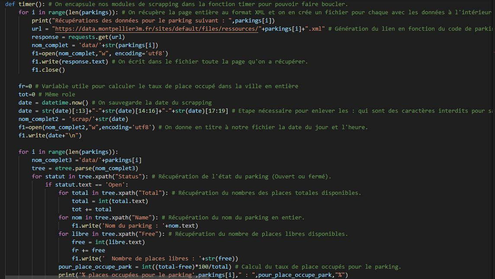
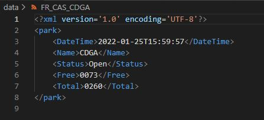
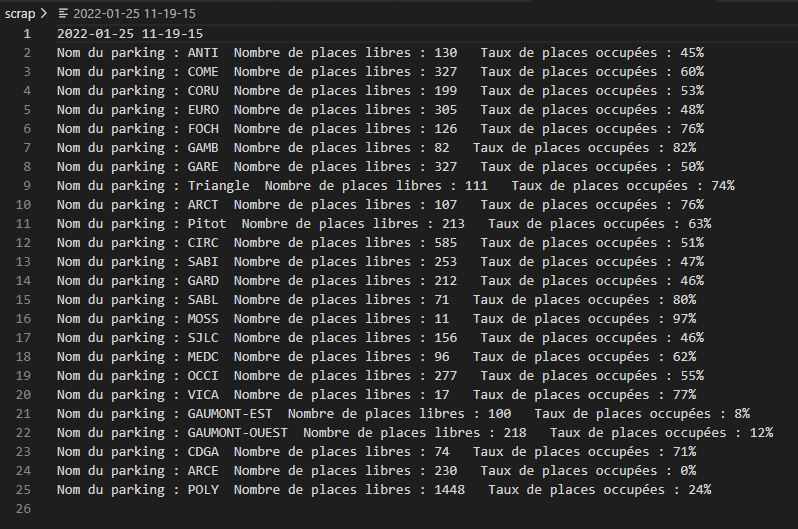
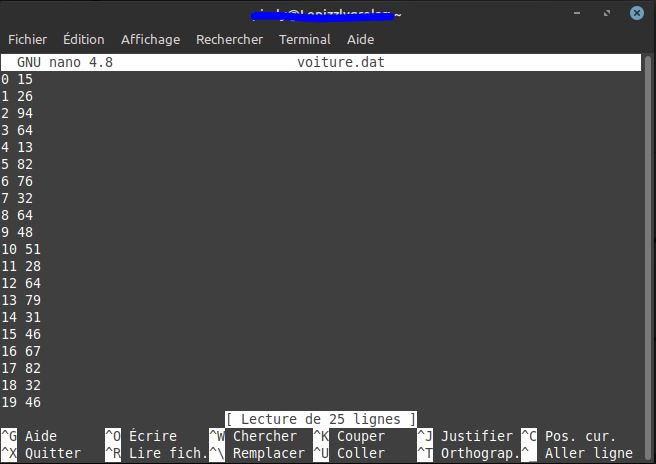
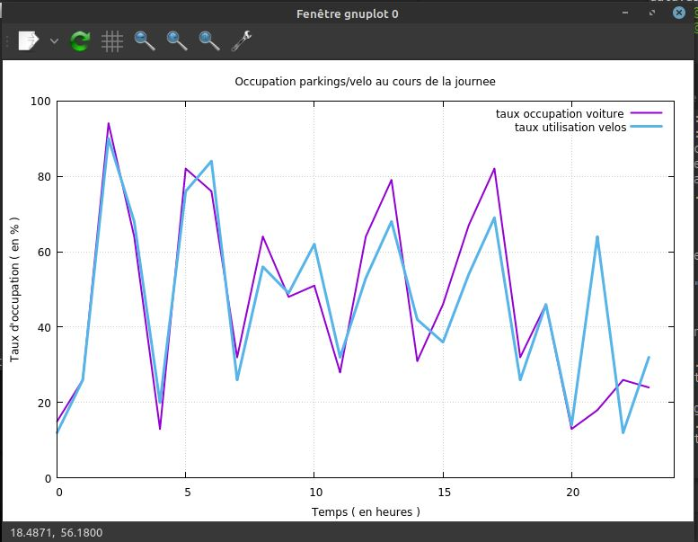

# Scrapping des données des parkings de la ville de Montpellier
## Introduction : 
## Notre projet consiste à récupérer en temps réel les données des **parkings routiers** de la ville de Montpellier ainsi que les utilisations des **stations de vélo** de cette même ville pour analyser l'influence entre les deux. 
## Pour ceci, nous avons écrit des scripts python qui récupère les données mesurées en quasi temps réel ( toutes les 5-10 minutes ) de l'activité des parkings routier ainsi que ceux pour les vélos, qui sont disponibles sur le site ***data.montpellier3m.fr***.

----
# Notre réalisation : 

*extrait de notre code*
## Ci-dessus, vous pouvez entrevoir un bout de notre code Python qui nous permet de récupérer les données afin de les stocker dans plusieurs fichiers que nous allons expliquer au fur et à mesure.
## Le code marche de cette manière : 
>* ## Il récupère les **données** de **chaque parking** sous format **xml**
>* ## Il les **classe** ensuite dans un dossier nommé **'data'**
>* ## Il va ensuite **récupèrer** les valeurs précises (comme le nombre de places libres,totales...) dans les fichiers à l'intérieur du dossier data
>* ## Il va faire un **résumé** pour **chaque parking** de ce qu'il a récupérer et va l'**écrire dans un nouveau fichier texte stocké dans le dossier 'scrap' avec comme nom la date et l'heure du scrapping.** *Cela nous sert à comprendre les données pour vérifier les éventuelles erreurs.*
>* ## Finalement, il va **stocker** dans un nouveau fichier stocké dans le dossier 'data_graph' et qui nous servira réellement **pour l'évaluation de l'utilisation des différents parkings**
>* ## Avec les données récoltés, un **graphique** (*produit avec GnuPlot*) se crée **en temps réel** et **s'actualise toutes les 24h** (*crée un autre graphique pour chaque jours*)
>* ## Et ce, pour à la fois les vélos ainsi que les parkings routier.
## Il est important de noter que, pour créer les graphiques, nous avons choisi d'utiliser le **taux d'occupation des parkings routiers et le taux d'utilisation de vélos** **pour toute la ville**.
## Et enfin, **le programme se relance toutes les 24h en entier** et **récupère des données toutes les heures**, pour éviter les **problèmes d'actualisation** qu'on peut avoir avec le site d'OpenData.
-----
# Proof of Concept
## Exemple d'un fichier XML récupéré : 

## Exemple d'un 'résumé' de scrapping : 

## Exemple des données récoltés pour le graphique : 

## Exemple de résultat final pour le graphique avec *GnuPlot* :
  

---- 
# Détails techniques 
## Pour le graphique avec gnuplot, nous avons choisi les options suivantes : 
    set yrange [0:100]  # Vu que nous avons seulement des données entre 0 et 100%
    set xrange [0:23]  # Pour afficher les heures de minuit à 23 heures. 
    set title "Occupation parkings/velo au cours de la journee"  
    set xlabel "Temps ( en heures )"  
    set ylabel "Taux d'occupation ( en % )"  
## Et finalement, pour tracer le graphique :
    plot "voiture.dat" title"taux occupation voiture" linewidth 2 linecolor 1 with lines,"velo.dat" title"taux utilisation velos" linewidth 3 linecolor 3 with lines

-----
# Optimisations et améliorations :
## Nous voulons approfondir un peu plus notre projet en rajoutant :
* ## La création de **graphiques pour chaque parking**
* ## Des **graphiques plus précis et poussés** en prenant en compte la **localisation des parkings vélos proches de chaque parking routiers** pour confirmer la véritable corrélation Occupation parking/Utilisation des vélos

----
# Notes : 
* ## Le programme n'est pas encore totalement fonctionnel (Il manque l'implémentation des vélos dans les données pour tracer de véritables graphiques)
* ## Il faudrait également beaucoup plus de temps pour pouvoir mesurer sur de longues périodes pour avoir des conclusions plus pertinentes et précises.
